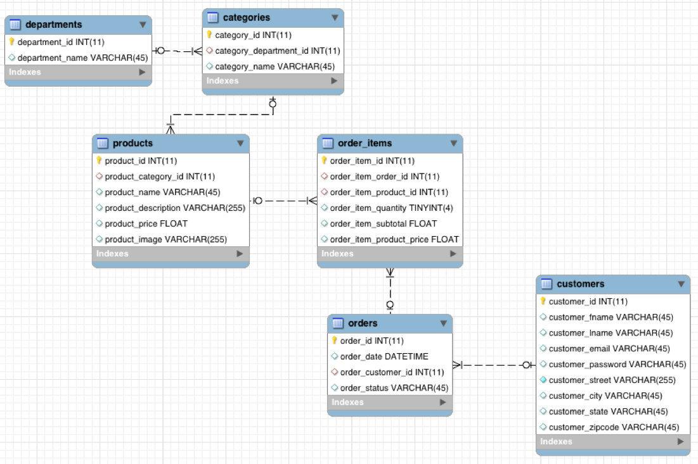

# Universidad EAFIT
# Curso CEC Big Data, 20191
# Profesor: Edwin Montoya M. – emontoya@eafit.edu.co

# Laboratorio HDFS - Mysql -> HDFS vía SQOOP

## 1. Conexión al cluster Hadoop

Ambari Web

    https://hdp1.dis.eafit.edu.co (sandbox)
    https://hdp2.dis.eafit.edu.co (cluster)

Terminal:

    https://hdp1shell.dis.eafit.edu.co (sandbox)
    https://hdp2shell.dis.eafit.edu.co (cluster)

Usuarios:

    username: cec##curso
    password: <enviado por email>

## 2. Datos de conexión a la base de datos MySQL

En cada uno de los servidores shellX hay un servidor de base de datos MySQL con las bases de datos y datos de conexión:

IP: 192.168.10.80

SUPUESTO: Los accesos a la base de datos mysql se realizar´

PORT: 3306

BASE DE DATOS 1: bdname = cursodb
USER:       curso
PASS:       curso
Tabla(s):   employee

BASE DE DATOS 2: bdname = retail_db
USER:       retail_dba
PASS:       caoba
Tabla(s):   categories, customers, departments, order_items, orders, products

ver modelo de datos:

## 3. Extraer(E) y Cargar (L) (del proceso ETL) de una base de datos MySQL hacia HDFS vía Sqoop

Desde la Terminal shellX, ejecutar:

1. Extraer UNA tabla especifica de una base de datos MySQL hacia un área 'stage' del home del usuario:

En shellX:

    $ sqoop import --connect jdbc:mysql://192.168.10.80:3306/cursodb --username curso -P --table employee --target-dir=/user/<username>/employee -m 1 --mysql-delimiters

Verifique la importación:

    $ hdfs dfs -ls /user/<username>/employee
    $ hdfs dfs -cat /user/<username>/employee/part-m-00000

2. Extraer TODAS las tablas de una base de datos MySQL hacia un área 'stage' del home del usuario:

En shellX:

    $ sqoop import-all-tables --connect jdbc:mysql://192.168.10.80:3306/cursodb --username=curso --password=curso --warehouse-dir=/user/<username>/cursodb -m 1 --mysql-delimiters

Verifique la importación:

    $ hdfs dfs -ls /user/<username>/cursodb
    $ hdfs dfs -ls /user/<username>/cursodb/employee
    $ hdfs dfs -cat /user/<username>/cursodb/employee/part-m-00000

3. Realice el proceso de importación de: (A) UNA tabla especifica de 'retail_db' hacia hdfs, y (B) Todas las tablas de 'retail_db' hacia /user/'username'/retail_db